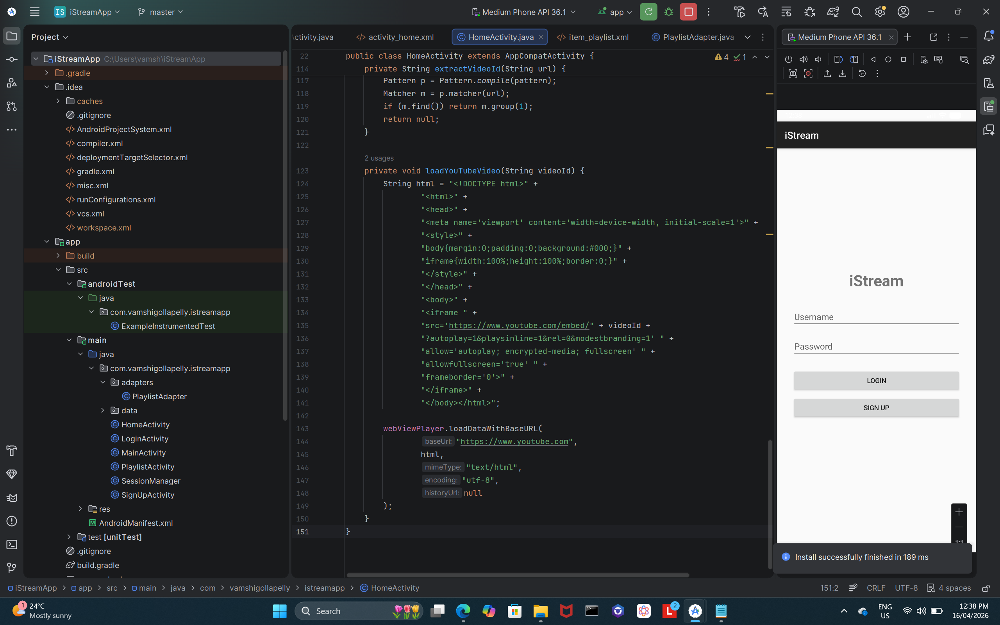
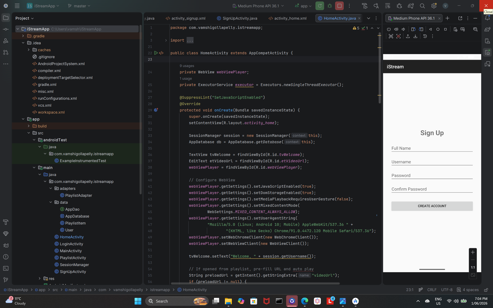

# iStreamApp

An Android video playlist manager that lets users register, log in, and build a personal YouTube playlist. Each user sees only their own saved videos — authentication, session management, and per-user data isolation all handled locally on device.

---

## Screenshots

> Add screenshots after running the app on an emulator

| Login | Sign Up | Home | Playlist |
|---|---|---|---|
|  |       |

---

## Features

- **User registration & login** — full name, username, password with confirmation
- **Per-user playlist isolation** — each account only sees its own saved videos
- **YouTube video playback** — paste any valid YouTube URL, plays inside the app via WebView + iFrame API
- **Add to playlist** — save any video to your personal playlist with one tap
- **Persistent sessions** — SharedPreferences keeps the user logged in between app restarts
- **Input validation** — invalid URLs show a helpful error message; empty fields are blocked
- **Logout** — available from both Home and Playlist screens

---

## Tech stack


| Layer | Technology |
|---|---|
| Language | Java |
| Local database | Room Database (users + playlists) |
| Session management | SharedPreferences |
| Video playback | WebView + YouTube iFrame API |
| Architecture | Multiple Activities |
| Build | Gradle |

---

## Architecture

```
app/
├── model/
│   ├── User.java               # Room @Entity — user accounts
│   └── PlaylistItem.java       # Room @Entity — saved videos per user
├── database/
│   ├── UserDao.java            # DAO — register, login queries
│   ├── PlaylistDao.java        # DAO — add, fetch, delete videos
│   └── AppDatabase.java        # Room database instance
├── session/
│   └── SessionManager.java     # SharedPreferences — login state
└── ui/
    ├── LoginActivity.java      # Login screen
    ├── SignUpActivity.java      # Registration screen
    ├── HomeActivity.java        # Paste URL + play + add to playlist
    └── PlaylistActivity.java   # View all saved videos
```

---

## Screens

**Login screen**
- Username + password fields
- Validates credentials against Room Database
- On success, saves session via SharedPreferences

**Sign up screen**
- Full name, username, password, confirm password
- Validates no duplicate usernames
- Stores new user securely in local Room Database

**Home screen**
- Paste any YouTube URL into the input field
- Video plays inline using WebView with YouTube iFrame embed
- "Add to Playlist" saves the current video to the logged-in user's playlist
- Invalid or malformed URLs trigger an error message

**Playlist screen**
- Displays all videos saved by the currently logged-in user
- Tap any item to play it immediately
- Each user's playlist is completely isolated from other accounts

---

## Data model

```
User
├── id (PK, autoincrement)
├── fullName
├── username (unique)
└── password

PlaylistItem
├── id (PK, autoincrement)
├── userId (FK → User.id)
├── videoUrl
└── addedAt
```

Foreign key on `userId` ensures each playlist item belongs to exactly one user.

---

## Getting started

### Prerequisites
- Android Studio Hedgehog or later
- Android SDK 26+
- Java 11+
- Internet connection (required for YouTube video playback)

### Run locally

```bash
git clone https://github.com/Vamshi-Gollapelly/iStreamApp.git
```

1. Open in Android Studio
2. Let Gradle sync
3. Run on emulator or physical device (API 26+)
4. Create an account on the Sign Up screen to get started

---

## Planned improvements

- [ ] Replace plaintext password storage with bcrypt hashing
- [ ] Add video thumbnails to the playlist using YouTube Data API
- [ ] Allow users to reorder or delete individual playlist items
- [ ] Search/filter within the playlist

---

## What I learned

- Implementing a full user authentication flow without a backend server
- Using Room Database relationships (foreign keys) to isolate per-user data
- Managing login sessions with SharedPreferences across app restarts
- Embedding YouTube video playback with WebView and the iFrame Player API
- Handling URL validation and graceful error messaging

---

## Author

**Vamshi Gollapelly**
[LinkedIn](https://linkedin.com/in/vamshigollapelly) · [GitHub](https://github.com/Vamshi-Gollapelly) · [Email](mailto:vamshigollapelly225@gmail.com)
